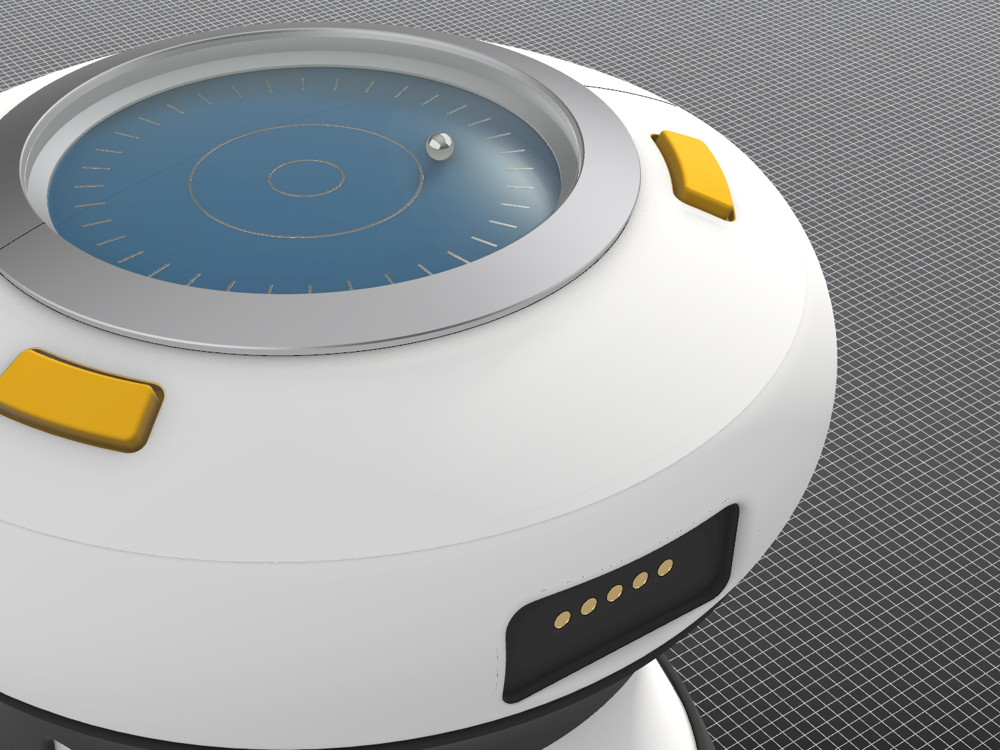

Hello! My name is **Shan-Wei Sun** and here you can check out some my projects. Please enjoy. 

# Recent Works

{% set items = [
  { image: '/assets/img/test_image.png', title: 'Flexible Robotic Tentacle', caption: 'Caption for test image 1. Should show an image of a robotic tentacle.' },
  { image: '/assets/img/Bent_R_V_Q.jpg', title: 'Modeling of a Thin-Film Resistor', caption: 'Thin-film resistor model showing equipotential lines, current flow, and calculated resistance.' },
  { image: '/assets/img/zs_boards.jpeg', title: 'Look for the Mark', caption: 'Many PCBs I have designed bare my signature. Look around, you might find one!' }
] %}


{{ render_cards(items) | safe }}

<article style="overflow:hidden;">
    
    <h2>Test Title</h2>
    
floating images test. here is a paragraph of stuff to see how the text wraps around the image.

    
here is even more text to see how it wraps around the image. hopefully it looks good and not too crazy.

</article>

<article style="overflow:hidden;">
    
    <h2>Test Title</h2>
    
floating images test. here is a paragraph of stuff to see how the text wraps around the image. This image will be on the right side of the text.

</article>

here is even more text to see how it wraps around the image. please behave.

    

        
left container

    

    

        
right container

    

<article style="overflow:hidden;">
    
    
image with some text within an article wrapper. here's some more to fill some space. ABC DEFGHI JKLM NOP QRST UVWXYZ.

</article>

<article style="overflow:hidden;">
    

        
        
        
        
    

    
some grid here with images

</article>

  

    

        
    

  

  

    

        
    

  

  

    

        
    

  

  

    

        
    

  

